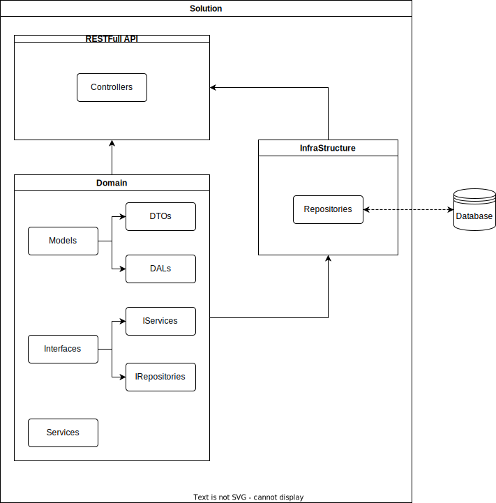
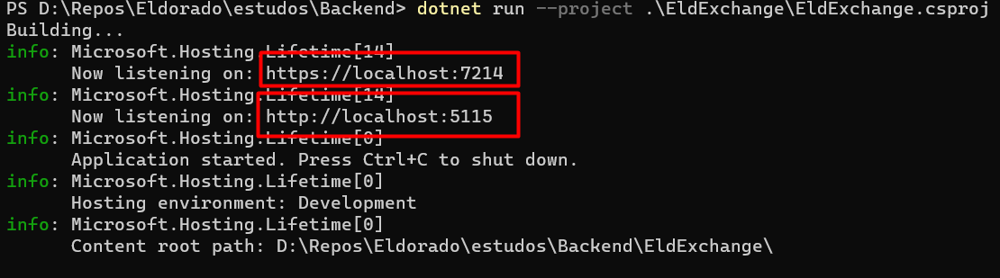
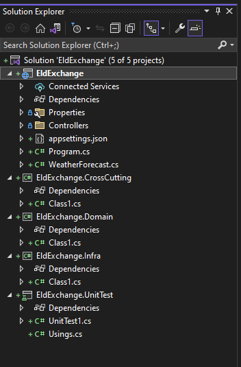
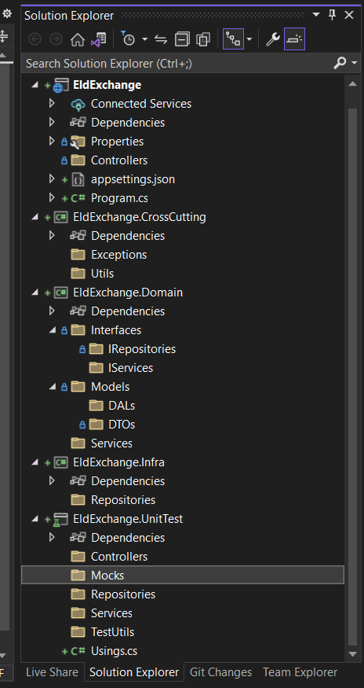

# 1° Encorntro

Neste primeiro encontro temos por objetivos: 

* Apresentação das Ferramentas a serem usadas
* Apresentação do problema a ser resolvido
* Modelagem Inicial do problema (UML)
* Criação das Historias Iniciais (Jira Confluence)
* Criação do ambiente de desenvolvimento (Estrutura da Solução)

## Ferramentas

* [git](https://git-scm.com/)
* [Github](https://github.com/)
* [Git-flow](https://www.atlassian.com/git/tutorials/comparing-workflows/gitflow-workflow)
* [Github Actions](https://docs.github.com/en/actions)
* [DotNet 6](https://dotnet.microsoft.com)
* [Visual Studio](https://visualstudio.microsoft.com)
* [Visual Studio code](https://code.visualstudio.com/)
* [Astah](https://astah.net/)
* [BrModel](https://www.brmodeloweb.com/lang/pt-br/index.html)
* [Versionize](https://github.com/versionize/versionize)
* [conventional commit messages](https://conventionalcommits.org/)

## Estrutura da Solução

Construiremos uma solução Dotnet 6 buscando seguindo um modelo de projeto em camadas, onde buscamos seguir os principios do S.O.L.I.D. 

* S - Single Responsiblity Principle (Princípio da responsabilidade única)
* O - Open-Closed Principle (Princípio Aberto-Fechado)
* L - Liskov Substitution Principle (Princípio da substituição de Liskov)
* I - Interface Segregation Principle (Princípio da Segregação da Interface)
* D - Dependency Inversion Principle (Princípio da inversão da dependência)

A estrutura básica da solução que iremos utilizar é a seguinte:



Observer que é muito parecida com a proposta nesse artigo [Começando com .NET Core, com Arquitetura em Camadas](https://alexalvess.medium.com/criando-uma-api-em-net-core-baseado-na-arquitetura-ddd-2c6a409c686) que pode ser vista na figura a baixo


Porém nesse artigo ele optaram por separar uma camada a mais que foi chamada de "Service" ou camada de serviço, porém eu considero melhor deixar a lógica de service dentro do "domain" reduzindo minha lógica para apenas 3 camada principais com as seguintes responsabilidades:

* Domain => Modelagem e Lógica de negocio
* Infraestructure => Acesso a informação armazenada (banco de dados ou cliente HTTP ou acesso a leitura de arquivos)
* Main Api => Controller e configuração do pipeline

Observe que com a lógica dessa maneira toda a implementação de services e repositories podem ficar ocultas por trás de interfaces, mantendo um baixo acoplamento seja pelo uso do banco de dados que pode ter a implementação modificada a qualquer momento, ou pela estrutura do Main Api que pode ser modificado para um MVC completo ou uma interface desktop.

Para completar a estrutura da ainda temos um projeto de testes untários e um projeto chamado "Cross-cutting".

Existe uma discussão longa sobre o que deve ser incluido no projeto de cross-cutting que por sua definição é um projeto que passa por todos as camadas perpendicularmente, mas alguns dos itens que podem ser incluidos são Sistemas de log e auditoria, Exceções e controle de exceção, sistemas de validação que sejam independente da lógica do sistema.

Algumas equipes gostam de incluir no cross-cutting definições de configuração do pipeline, porém essa pratica não me agrada, pois isso faz com que o cross-cuttting passe a ter conhecimento dos sistemas internos da aplicação, o que ao meu entender deveria ser evitado ao máximo, pois se o cross-cutting for bem desenvolvido e devidamente testado, poderia ter sua maior parte removida do projeto e passar a um tipo de biblioteca especial da organização que possua diversas funcionalidades especiais para serem usadas.

## Criando a Solução usando o CLI do dotnet

O Cli do dotnet é uma ferramenta muito poderosa e normalmente ignorada pela maioria dos novatos devido a grande facilidade de se usar o visual studio, que permite fazer tudo apenas selecionando um conjunto caixas de seleção e dando alguns poucos cliques, portanto, nesse primeiro momento faremos usso do cli do dotnet para demonstrar sua usabilidade.

Vale resaltar que em processo de CI/CD o cli do dotnet é uma ferramente indispensável, sendo muitas vezes a única opção disponível, logo recomendamos fortemente o seu estudo.

[.NET CLI overview](https://learn.microsoft.com/en-us/dotnet/core/tools/)

1. Começamos criando a solução, com o uso da opção "-n EldExchange" definimos o nome da solução para "EldExchange" for ignorada a solução terá o nome da parta.

```
dotnet new sln -n EldExchange
```

2. Para criarmos a RESTFull Web api usamos, assim iremos criar a tradicional webapi do WeatherForecast, com um controller e um model que em breve iremos deletar, essa opção é melhor do que a empty, pois já começa com o swagger configurado entre outras opções uteis.

```
dotnet new webapi -n EldExchange -o EldExchange -f net6.0
```

3. Para criarmos as bibliotecas de class

```
dotnet new classlib -n EldExchange.Domain -o EldExchange.Domain -f net6.0
dotnet new classlib -n EldExchange.Infra -o EldExchange.Infra -f net6.0
dotnet new classlib -n EldExchange.CrossCutting -o EldExchange.CrossCutting -f net6.0
```

4. Para o test unitários faremos

```
dotnet new xunit -n EldExchange.UnitTest -o EldExchange.UnitTest -f net6.0
```

5. Para finalizar precisamos juntar tudo em uma única solução

```
dotnet sln add EldExchange EldExchange
dotnet sln add EldExchange EldExchange.Domain
dotnet sln add EldExchange EldExchange.Infra
dotnet sln add EldExchange EldExchange.CrossCutting
dotnet sln add EldExchange EldExchange.UnitTest
```

6. Para executar o programa use e basta ir em [https://localhost:7214/swagger](https://localhost:7214/swagger) ou em [http://localhost:5115/swagger](http://localhost:5115/swagger) de acordo com a figura para poder ver o programa executando, e use ctrl+C para parar a execução ou feche o console.



```
dotnet run --project .\EldExchange\EldExchange.csproj
```

7. Ao abrir o Visual Studio ele deve está como, execute:



parabens você conclui com sucesso a criação de uma solução dotnet sem usar o visual studio. 

8. No visual Studio vamos adicionar as dependencias de todos os projetos. clicando em Dependencies como botão direito do mouse, selecione add project reference e adicione as referencias de acordo com a seguinte lógica:

* Cross-cutting => não recebe ninguem
* Domain => só recebe Cross-cutting
* Infra => recebe Cross-cutting e domain
* WebApi => recebe Cross-cutting, domain e infra
* Unit test => recebe todo mundo

9. Vamos deletar todo o lixo (Class1.cs, UnitTest1.cs, WeatherForecast.cs, WeatherForecastController.cs) e adicionar as pastas até chegar no seguinte estado



Observe que todas as pastas foram colodas no plural, pela lógica de nomeclatura as classes destinadas a cada pasta deve respeitar a nomeclatura: \<Nome>+\<NomePasta>.cs, por exemplo: 
PessoaService.cs, PessoaRepositorie.cs, PessoaDTO.cs. No caso das pastas IServices e IRepositories, esse "I" que inicia  o nome da pasta é completamente desnecessário, foi colocado aqui para lebrar da regrar de que toda interface em C\# começa com a letra "I", logo teremos: IPessoaService.cs, IPessoaRepository.cs.

## Referências

* [PrinciplesOfOod](http://butunclebob.com/ArticleS.UncleBob.PrinciplesOfOod)
* [O que é SOLID: O guia completo para você entender os 5 princípios da POO](https://medium.com/desenvolvendo-com-paixao/o-que-%C3%A9-solid-o-guia-completo-para-voc%C3%AA-entender-os-5-princ%C3%ADpios-da-poo-2b937b3fc530)
* [Wikipedia - Solid](https://en.wikipedia.org/wiki/SOLID)
* [SOLID: The First 5 Principles of Object Oriented Design](https://www.digitalocean.com/community/conceptual-articles/s-o-l-i-d-the-first-five-principles-of-object-oriented-design)